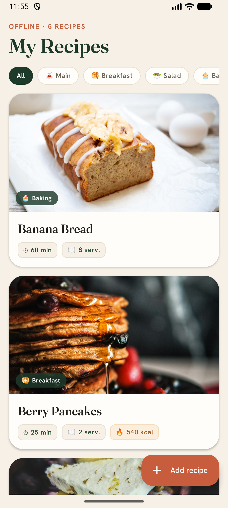
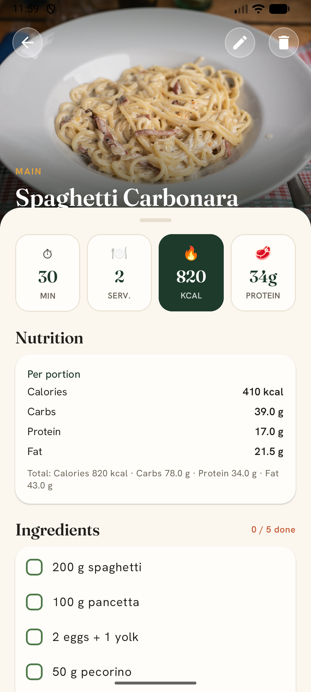
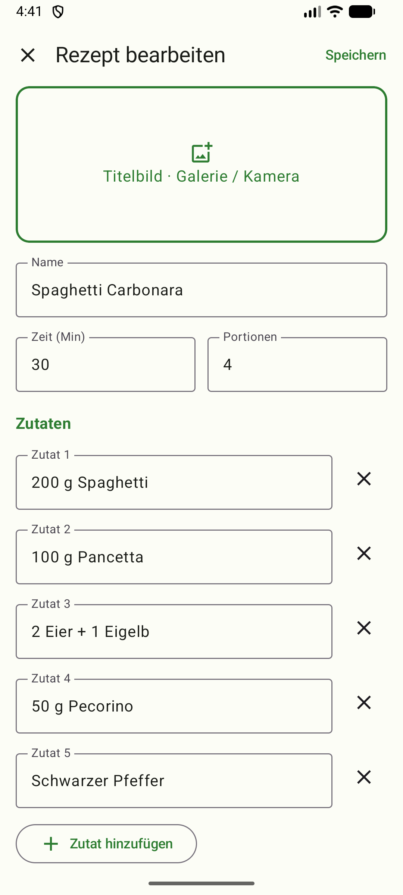

# Recipely 🍃

A lean, native **Android app** for creating, viewing, editing and deleting cooking recipes — fully **offline**, with a modern Material 3 UI in fresh green.

Each recipe has a name (required), an optional title image, optional prep time and servings, an ingredient list, and numbered preparation steps with an optional image per step. The UI is fully localized — **English by default, German on German-locale devices.**

## Screenshots

<p align="center">
  
  &nbsp;&nbsp;
  
  &nbsp;&nbsp;
  
</p>

<p align="center">
  <em>Recipe list &nbsp;·&nbsp; Detail view &nbsp;·&nbsp; Editor &nbsp;— shown with demo data</em>
</p>

> Light and dark themes are supported automatically (the screenshots show light mode).

## Features

- 📋 **Recipe list** with compact rows (thumbnail, name, "⏱ time · 🍽 servings"), sorted alphabetically
- 👀 **Detail view**: title image, time/servings chips, ingredient list, numbered steps with an optional step image
- ✏️ **Create & edit** via a dynamic form (add/remove ingredients and steps freely)
- 🖼️ **Images** from the **gallery** (Photo Picker) or **camera** — for the title image and per step
- 🗑️ **Delete** with a confirmation dialog
- 💾 **Offline-first**: local storage via Room; images are copied into app-internal storage and the database keeps only the paths — orphaned image files are cleaned up automatically
- 🌍 **Localized**: English (default) and German
- 🎨 Fixed green **Material 3** theme (light/dark automatic)

## Tech stack

- **Kotlin** 2.0.21
- **Jetpack Compose** + **Material 3** (Compose BOM 2024.09.03), Navigation-Compose
- **Room** (local SQLite persistence) with **KSP**
- **Coil** for image loading
- Coroutines / `StateFlow`
- Architecture: **single-Activity, lean MVVM** with manual DI (no Hilt/Dagger)
- Tests: JUnit 4 + `kotlinx-coroutines-test` (JVM), AndroidX Test (instrumented Room DAO test)

## Architecture

Single-Activity Compose app following **lean MVVM**: Compose UI → ViewModel → Repository → Room DAO.

```
RecipelyApp (Application)
  └─ AppContainer (manual DI)
       ├─ RecipeDatabase (Room)  → RecipeDao
       ├─ ImageStore (internal image storage)
       └─ RoomRecipeRepository
            ▲
   ViewModels (List / Detail / Edit)
            ▲
   Compose Screens  ── RecipelyNavHost (list · detail/{id} · edit?id={id})
```

Details and project-wide conventions are in [`CLAUDE.md`](CLAUDE.md); the design spec and implementation plan live under [`docs/superpowers/`](docs/superpowers/).

## Build & run

**Prerequisites**

- Android SDK (compileSdk/targetSdk **36**, minSdk **24**); a `local.properties` with `sdk.dir` (generated by Android Studio)
- **Gradle runs on a JDK ≤ 21.** The Java 11 level in the build config is only the *bytecode* level, not the JDK that runs Gradle. Android Studio uses its bundled JBR (21) automatically. For **CLI builds**, set the JDK if your system default is newer (e.g. JDK 24, which Gradle 8.13 does not support):

  ```powershell
  $env:JAVA_HOME = "C:\Program Files\Android\Android Studio\jbr"
  ```

**Build / install** (Windows/PowerShell — otherwise `./gradlew`):

```powershell
.\gradlew.bat assembleDebug     # build the debug APK
.\gradlew.bat installDebug      # install on a connected device/emulator
```

Alternatively, open the project in **Android Studio** and press ▶ Run.

## Tests

```powershell
.\gradlew.bat testDebugUnitTest          # JVM unit tests (mapping + ViewModels)
.\gradlew.bat connectedDebugAndroidTest  # instrumented Room DAO test (device/emulator required)
```

Single tests:

```powershell
.\gradlew.bat testDebugUnitTest --tests "com.nwe.recipely.RecipeMappingTest"
.\gradlew.bat connectedDebugAndroidTest -Pandroid.testInstrumentationRunnerArguments.class=com.nwe.recipely.RecipeDaoTest
```

## Project structure

```
app/src/main/java/com/nwe/recipely/
├─ RecipelyApp.kt            # Application + holds AppContainer
├─ MainActivity.kt           # single Activity → Compose + NavHost
├─ di/AppContainer.kt        # manual DI (DB, ImageStore, Repository)
├─ data/                     # Room: entities, DAO, Database, ImageStore, Repository
├─ navigation/               # RecipelyNavHost + Routes
└─ ui/
   ├─ theme/                 # green Material 3 theme (Color/Type/Theme)
   ├─ list/                  # RecipeListScreen + ViewModel
   ├─ detail/                # RecipeDetailScreen + ViewModel
   └─ edit/                  # RecipeEditScreen + ViewModel + form state/mapping
```

UI strings are localized via `app/src/main/res/values/strings.xml` (English) and `values-de/strings.xml` (German).

## Out of scope (by design)

Search, tags/categories, cloud sync, export/share and serving scaling are intentionally not included — the app stays simple and focused on the essentials.
